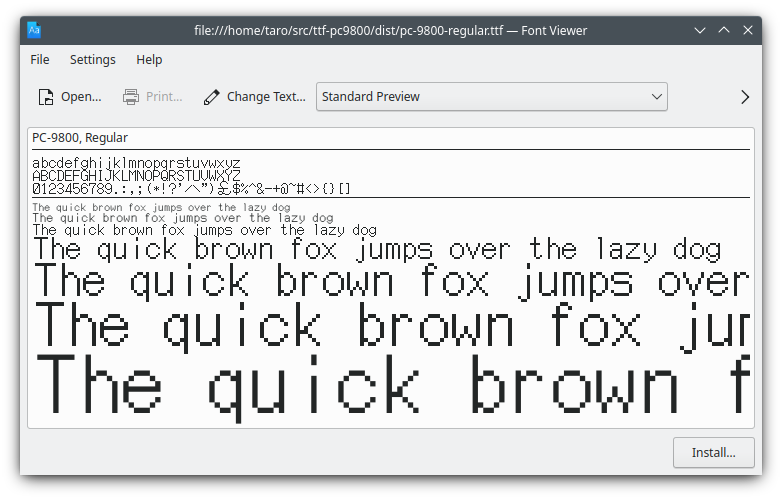

# ttf-pc9800

ttf-pc9800 is a font converter for the NEC PC-9800 series.
It converts the FONT.ROM of the PC-9800 into TTF format.
In order to use it, you need the FONT.ROM of the PC-9800.




## Instruction (Debian / Ubuntu)

Place the font ROM image in the `data/FONT.ROM` and execute the `make` command.
Upon successful execution of make, a TTF file will be generated in the `dist` directory.

```
$ sudo apt install git make ruby fontforge-nox potrace bdfresize
$ git clone https://github.com/hikaen2/ttf-pc9800.git
$ cd ttf-pc9800
$ cp </path/to>/FONT.ROM data/FONT.ROM
$ make
```

Note:
FontForge may give the following warning, but there is no problem:
"I'm sorry this file is too complex for me to understand (or is erroneous)."
